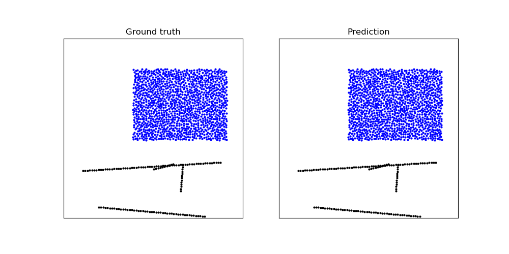

# Introduction

**This is a copy from github repo [deepmind/learning_to_simulate](https://github.com/deepmind/deepmind-research/tree/master/learning_to_simulate).**

> Learning to Simulate Complex Physics with Graph Networks (ICML 2020)
> 
> ICML poster: [icml.cc/virtual/2020/poster/6849](https://icml.cc/virtual/2020/poster/6849)
> 
> Video site: [sites.google.com/view/learning-to-simulate](https://sites.google.com/view/learning-to-simulate)
> 
> ArXiv: [arxiv.org/abs/2002.09405](https://arxiv.org/abs/2002.09405)



# Usage

After downloading the repo, `cd` to parent folder and install dependencies:

```bash
conda create -n work -c anaconda python=3.7 -y
conda deactivate
conda activate work
pip install -r learning_to_simulate/requirements.txt
pip install tensorflow-1.15.5-cp37-cp37m-manylinux2010_x86_64.whl
mkdir -p /tmp/rollous
```

1. Download dataset (e.g. `WaterRamps`):

```bash
mkdir -p /tmp/datasets
bash ./download_dataset.sh WaterRamps /tmp/datasets
```

2. Train a model

```bash
mkdir -p /tmp/models
python -m learning_to_simulate.train \
    --data_path=/tmp/datasets/WaterRamps \
    --model_path=/tmp/models/WaterRamps
```

3. Generate trajectory

```bash
mkdir -p /tmp/rollouts
python -m learning_to_simulate.train \
    --mode="eval_rollout" \
    --data_path=/tmp/datasets/WaterRamps \
    --model_path=/tmp/models/WaterRamps \
    --output_path=/tmp/rollouts/WaterRamps
```

4. Plot a trajectorybas

```bash
python -m learning_to_simulate.render_rollout \
    --rollout_path=/tmp/rollouts/WaterRamps/rollout_test_0.pkl
```

# Datasets

Datasets are available to download via:

1. Metadata file with dataset information (sequence length, dimensionality, box bounds, default connectivity radius, statistics for normalization, ...): `https://storage.googleapis.com/learning-to-simulate-complex-physics/Datasets/{DATASET_NAME}/metadata.json`

2. TFRecords containing data for all trajectories (particle types, positions, global context, ...): `https://storage.googleapis.com/learning-to-simulate-complex-physics/Datasets/{DATASET_NAME}/{DATASET_SPLIT}.tfrecord`

Where:

* `{DATASET_SPLIT}` is one of:
  
  * `train`
  * `valid`
  * `test`

* `{DATASET_NAME}` one of the datasets following the naming used in the paper:
  
  * `WaterDrop`
  * `Water`
  * `Sand`
  * `Goop`
  * `MultiMaterial`
  * `RandomFloor`
  * `WaterRamps`
  * `SandRamps`
  * `FluidShake`
  * `FluidShakeBox`
  * `Continuous`
  * `WaterDrop-XL`
  * `Water-3D`
  * `Sand-3D`
  * `Goop-3D`

The provided script `./download_dataset.sh` may be used to download all files from each dataset into a folder given its name.

An additional smaller dataset `WaterDropSample`, which includes only the first two trajectories of `WaterDrop` for each split, is provided for debugging purposes.

## Code structure

* `train.py`: Script for training, evaluating and generating rollout trajectories.
* `learned_simulator.py`: Implementation of the learnable one-step model that returns the next position of the particles given inputs. It includes data preprocessing, Euler integration, and a helper method for building normalized training outputs and targets.
* `graph_network.py`: Implementation of the graph network used at the core of the learnable part of the model.
* `render_rollout.py`: Visualization code for displaying rollouts such as the example animation.
* `{noise/connectivity/reading}_utils.py`: Util modules for adding noise to the inputs, computing graph connectivity and reading datasets form TFRecords.
* `model_demo.py`: example connecting the model to input dummy data.

> Note this is a reference implementation not designed to scale up to TPUs (unlike the one used for the paper). We have tested that the model can be trained with a batch size of 2 on a single NVIDIA V100 to reach similar qualitative performance (except for the XL and 3D datasets due to OOM).
